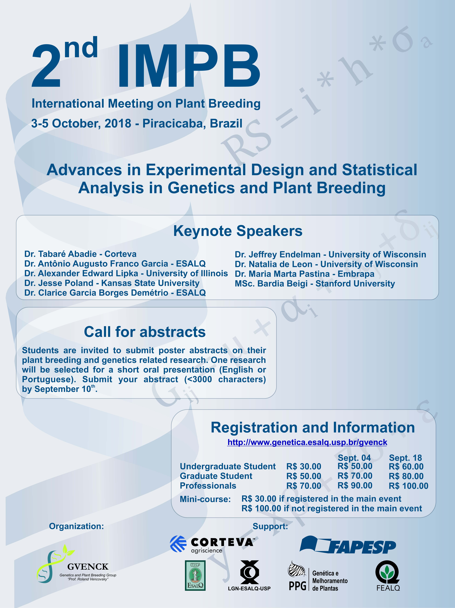

<h1>II INTERNATIONAL MEETING ON PLANT BREEDING</h1>
Advances in Experimental Design and Statistical Analysis in Genetics and Plant Breeding
 

<iframe width="560" height="315" src="https://www.youtube.com/embed/i5kKPzIIvtE?controls=0" frameborder="0" allow="accelerometer; autoplay; encrypted-media; gyroscope; picture-in-picture" allowfullscreen></iframe>

 

**Watch all Lectures**: [Click here](https://www.youtube.com/playlist?list=PLQgoXUJx1_7lty9r18f9ESlCeYXJR2tHy)

**Photo gallery**: [Click here](about:blank)

<!-- **Registration**: [Click here](http://fealq.org.br/en/informacoes-do-evento/?id=664)   -->
  
**Abstract rules**: [Click here](../abstract-rules/)  
  
**Submission deadline**: September 12th, 2018  
  
**Abstract submission**: Expired  
  
**Poster model**: [Click here](../files/model-poster.pptx)  
  
**About Speakers**: [Click here](../speakers2impb/)  

**Roland Vencovsky Award Rules**: [Click here](../award-rules/)  
  
**Poster presentation**: [Click here](../2impbposters/)  
  

## Program:

**October 3th (Wednesday)**

07:00 – 08:00 – Material Delivery

08:00 – 08:45 – Opening Session – Tabare Abadie - Corteva Agriscience - USA

08:45 – 09:45 – Lecture 1 - “Statistical Quantification of the Genomic Contribution towards Food and Energy-related Crop Traits”. Alexander Edward Lipka – University of Illinois – USA

09:45 – 10-15 – Coffee Break

10:15 – 11:15 – Lecture 2 - “Genotyping and building linkage maps in complex autopolyploid species”. Antônio Augusto Franco Garcia – ESALQ/USP 

11:15 – 12:00 – Poster Session 1

12:00 – 14:00 – Break

14:00 – 15:00 – Lecture 3 – “Artificial selection and the genetic architecture of economically important traits in Maize”.  Natalia De Leon – University of Wisconsin - USA

15:00 – 16:00 – Lecture 4 – “Application of Secondary Traits from High-throughput Phenotyping for Yield Prediction”. Jesse Poland – Kansas State University – USA

16:00- 16:30 - Coffe Break

16:30 – 17:30 – Lecture 5 – “Negative variance components for non-negative hierarchical data with correlation, over-, and/or underdispersion”. Clarice Garcia Borges Demetrio - ESALQ/USP

17:30 – 18:00 – Poster Session 2

19:00 – Official Event Dinner

**October 4th (Thursday)**

08:30 – 09:30 – Lecture 6 – “Genomics-Assisted Breeding for Autotetraploid Potato”. Jeffrey Endelman – University of Wisconsin - USA

09:30 – 10:00 – Coffee Break

10:00 – 11:00 – Lecture 7 – “Genomic predictions for abiotic stress tolerance in maize and sorghum”. Maria Marta Pastina – Embrapa Maize and Sorghum - Brazil

11:00 – 11:15 – "Roland Vencovsky" Award

11:15 – 11:30 – Closing Remarks

### MINI-COURSE

**October 5th (Friday) - MiniCourse**

08:30 – 09:45 – Course - “Statistical mechanisms and practical applications of genome-wide association studies, genomic selection, and related analyses”. Alexander Edward Lipka – University of Illinois – USA

09:45 – 10:15 – Coffee Break

10:15 – 11:45 – Course - “Statistical mechanisms and practical applications of genome-wide association studies, genomic selection, and related analyses”. Alexander Edward Lipka – University of Illinois – USA

12:00 – 14:00 – Break

14:00 – 16:00 – Course - “Statistical mechanisms and practical applications of genome-wide association studies, genomic selection, and related analyses”. Alexander Edward Lipka – University of Illinois – USA

16:00 – 16:15 – Coffee Break

16:30 – 17:00 – Course - “Statistical mechanisms and practical applications of genome-wide association studies, genomic selection, and related analyses”. Alexander Edward Lipka – University of Illinois – USA

17:00 – 17:15 – Closing Remarks

*Requirements for mini-course: basic statistics for plant breeding; familiar to R environment  
**Program may change according to demand without notification  

