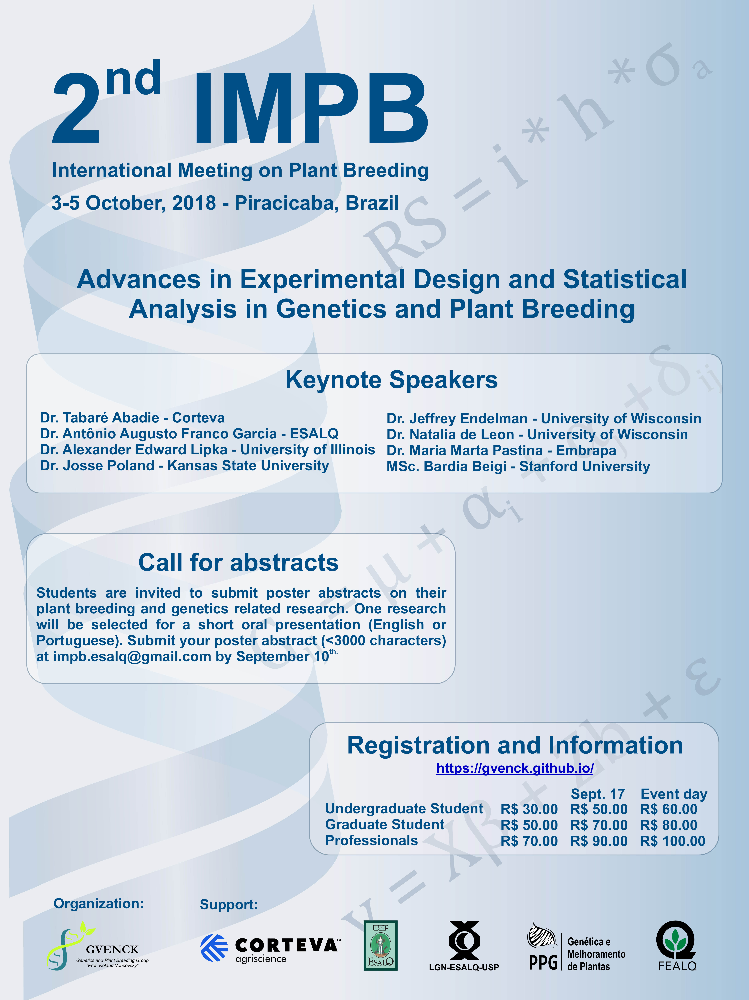

<h1>II INTERNATIONAL MEETING ON PLANT BREEDING</h1>

**Theme:** Advances in Experimental Design and Statistical Analysis in Genetics and Plant Breeding

**Registration**: [Click here](http://fealq.org.br/en/informacoes-do-evento/?id=664)

## Program:

**October 3th (Wednesday)**

07:00 – 08:00 – Material Delivery

08:00 – 08:45 – Opening Session – Tabare Abadie - DuPont Pioneer - USA

08:45 – 09:45 – Lecture 1 - “Statistical Quantification of the Genomic Contribution towards Food and Energy-related Crop Traits”. Alexander Edward Lipka – University of Illinois – USA

09:45 – 10-15 – Coffee Break

10:15 – 11:15 – Lecture 2 - “Genotyping and building linkage maps in complex autopolyploid species”. Antônio Augusto Franco Garcia – ESALQ/USP 

11:15 – 12:00 – Poster Session 1

12:00 – 14:00 – Lunch

14:00 – 15:00 – Lecture 3 – “Artificial Selection in Maize”.  Natalia De Leon – University of Wisconsin - USA

15:00 – 16:00 – Lecture 4 – “Application of Secondary Traits from High-throughput Phenotyping for Yield Prediction”. Jesse Poland – Kansas State University – USA

16:00- 16:30 - Coffe Break

16:30 – 17:30 – Lecture 5 – “Computer Vision Techniques in Agriculture”. Bardia Baigi - winner of Dow Crop Computer Modeling 2018

17:30 – 18:00 – Poster Session 2

19:00 – Official Event Dinner

**October 4th (Thursday)**

08:30 – 09:30 – Lecture 6 – “Genomics-Assisted Breeding for Autotetraploid Potato”. Jeffrey Endelman – University of Wisconsin - USA

09:30 – 09:45 – Lecture 7 – “Genomic predictions for abiotic stress tolerance in maize and sorghum”. Maria Marta – Embrapa Maize and Sorghum - Brazil

09:45 – 10:15 – Coffee Break

10:15 – 11:15 – Lecture 8 – “Talent acquisition and development, training and leadership in plant breeding and genetics”. Coach from Dow Agrosciences

11:15 – 11:30 – Best Poster's Presentation

11:30 – 12:00 – Closing Remarks

### MINI-COURSE

**October 5th (Friday) - MiniCourse**

08:30 – 09:45 – Course - “Statistical mechanisms and practical applications of genome-wide association studies, genomic selection, and related analyses”. Alexander Edward Lipka – University of Illinois – USA

09:45 – 10:15 – Coffee Break

10:15 – 11:45 – Course - “Statistical mechanisms and practical applications of genome-wide association studies, genomic selection, and related analyses”. Alexander Edward Lipka – University of Illinois – USA

12:00 – 14:00 – Lunch

14:00 – 16:00 – Course - “Statistical mechanisms and practical applications of genome-wide association studies, genomic selection, and related analyses”. Alexander Edward Lipka – University of Illinois – USA

16:00 – 16:15 – Coffee Break

16:30 – 17:00 – Course - “Statistical mechanisms and practical applications of genome-wide association studies, genomic selection, and related analyses”. Alexander Edward Lipka – University of Illinois – USA

16:00 – 16:15 – Closing Remarks

