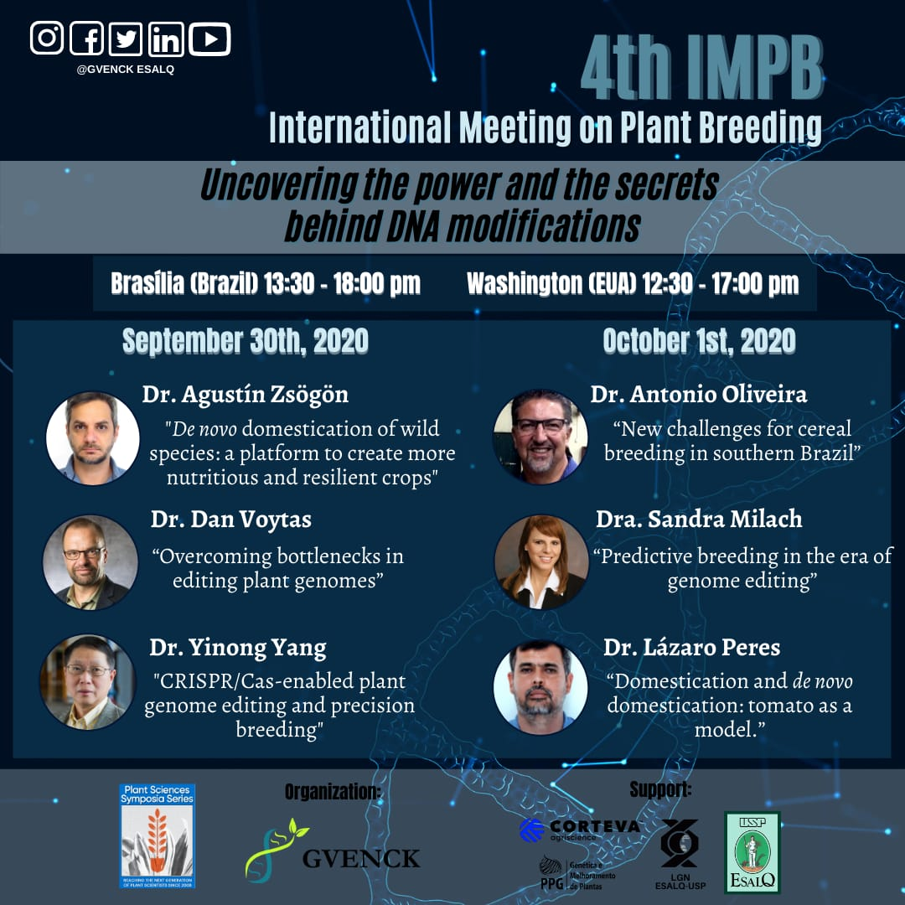

<h1>4th INTERNATIONAL MEETING ON PLANT BREEDING</h1>
<i>Uncovering the power and the secrets behind DNA modifications</i>

  

**Registration**: [Click here](https://forms.gle/pG4kvAhRAZkTn3XY8)  
  
**Abstract rules**: [Click here](../files/Rules_for_abstract_submissions.docx)  
  
**Submission deadline**: **September 10th, 2020**  
  
**Abstract submission**: [Click here](https://forms.gle/VAUAdnpbJZWEwMwr8)  
  
**Poster model**: [Click here](../files/model-poster-2020.pptx)  

**Roland Vencovsky Award Rules**: [Click here](../files/Rules_Roland_Vencovsky_Award.docx)  
  
**Poster presentation**: [Coming soon]()  
  

## Program:

**September 30th, 2020**

13:30 - 14:00 → Jason Rauscher - Opening session (Corteva)

14:00 - 15:00 → Agustin Zsögön - "De novo domestication of wild species: a platform to create more nutritious and resilient crops"  (Federal University of Viçosa - UFV)

15:00 - 16:00 → Daniel Voytas - “Overcoming Bottlenecks in Editing Plant Genomes” (University of Minnesota)

16:00 - 16:20 → Research Presentation

16:20 - 16:40 → Break

16:40 - 17:40 → Yinong Yang - "CRISPR/Cas-enabled plant genome editing and precision breeding" (Pennsylvania State University)

17:40 - 18:00 → Research Presentation

**October 1st, 2020**

13:30 - 14:30 → Antonio Costa de Oliveira - “New Challenges for Cereal Breeding in Southern Brazil” (Federal University of Pelotas - UFPel)

14:30 - 15:30 → Sandra Milach -  “Predictive Breeding in the Era of Genome Editing” (Corteva)

15:30 - 15:50 → Research Presentation

15:50 - 16:20 → Break

16:20 - 17:20 → Lázaro Eustáquio Pereira Peres - “Domestication and de novo domestication: tomato as a model.” (Luiz de Queiroz College of Agriculture - ESALQ/USP)

17:20 - 17:40 → “Roland Vencovsky” Award

17:40 - 18:00 → Closing remarks

