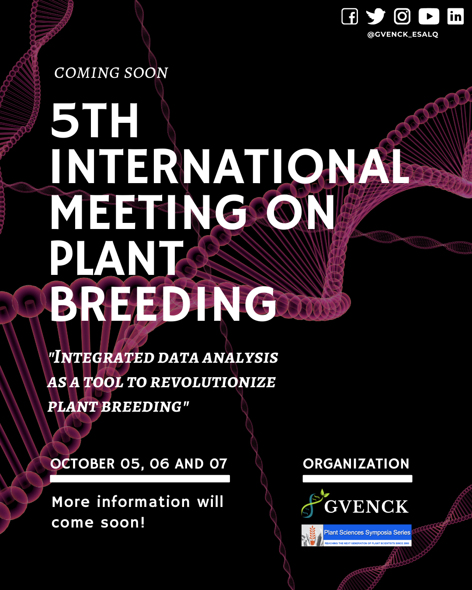

<h1>5th INTERNATIONAL MEETING ON PLANT BREEDING</h1>
<i>Integrated Data Analysis as a Tool to Revolutionize Plant Breeding</i>

  

**Registration deadline**: **October 4th, 2021**  
**Registration**: [Coming soon]()  
  
**Abstract rules**: [Click here](../files/Rules_for_abstract_submissions.docx)  
  
**Submission deadline**: **September 15th, 2021**  
  
**Abstract submission**: [Click here](https://docs.google.com/forms/d/e/1FAIpQLSchpuIXosALDSOyvZUSJFCYW3TT_8xK2NLi8Itg6GI4Xhx2Tw/viewform)  
  
**Poster model**: [Click here](../files/model-poster-2021.pptx)  

**Roland Vencovsky Award Rules**: [Click here](../files/Rules_Roland_Vencovsky_Award.docx)  
  
**Poster presentation**: [Coming soon]()  
  

## Program:
**Coming Soon**

